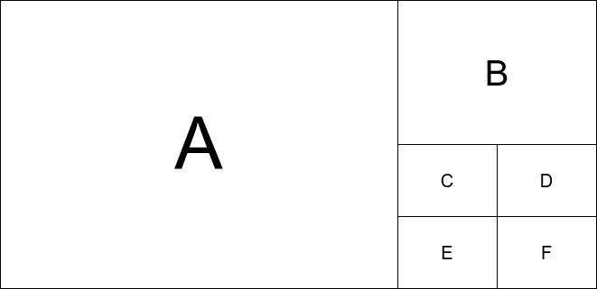

# Задание №3

OpenCV ‒ это библиотека алгоритмов компьютерного зрения, обработки изображений и численных алгоритмов общего назначения с открытым кодом.

Для её установки используйте команду

```(bash)
conda install -c conda-forge opencv
```

Ресурсы для ознакомления:

- [презентация](https://docs.google.com/presentation/d/16NaSX4D0JmmSz4puLTy5obq1a8IOU3GiKoyerDiKJr0/edit?usp=sharing) с базовыми операциями над изображениями

- оффициальный [сайт](https://opencv.org/)

- [документация](https://docs.opencv.org/4.2.0/)

- [Туториалы](https://opencv-python-tutroals.readthedocs.io/en/latest/py_tutorials/py_tutorials.html)

- [Примеры](https://www.learnopencv.com/) применения различных алгоритмов

## Задание в классе

Возьмите любую картинку и представьте её в следующем виде:



- A ‒ исходная картинка
- B ‒ уменьшенная в 2 раза и обработанная `Canny Edge Detector`
- C ‒ уменьшенная в 4 раза и пропущенная через фильтр усреднения (Averaging)
- D ‒ уменьшенная в 4 раза и пропущенная через гаусовский фильтр (Gaussian filtering)
- E ‒ уменьшенная в 4 раза и обработанная ядром, заданным вручную (сами выберите какое)
- F ‒ каждая ячейка имеет случайный цвет.

## Домашнее задание

В качестве домашнего задания предлагается реализовать сервис по обработке изображения. Клиентская часть предоставляет форму загруки изображения, а так же отображение до и после обработки. Серверная часть должна принимать картинку, обрабатывать одним из далее описанным алгоритмом и возвращать обратно.

Возможные алгоритмы обработки изображения:

- Image Сolorization ([tutorial](https://www.learnopencv.com/convolutional-neural-network-based-image-colorization-using-opencv/))
- Human Pose Estimation ([tutorial](https://www.learnopencv.com/deep-learning-based-human-pose-estimation-using-opencv-cpp-python/))
- Face Swapping ([tutorial](https://www.learnopencv.com/face-swap-using-opencv-c-python/))
- Object Detection ([tutorial](https://www.learnopencv.com/deep-learning-based-object-detection-using-yolov3-with-opencv-python-c/))

На каждый алгоритм допустимо не более 5 человек. Вы также можете реализовать свой алгоритм, предварительно обсудив со мной.
